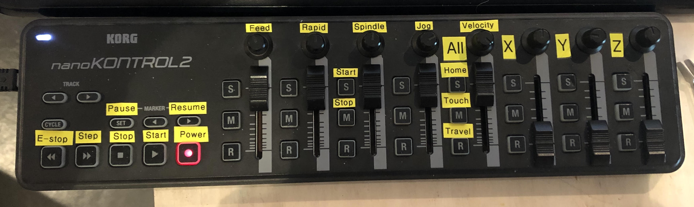

# linuxcnc-midi
[LinuxCNC](http://linuxcnc.org/) HAL module for mapping MIDI events to HAL pins. 


My mapping to LinuxCNC on KORG nanoKONTROL2:


## Dependencies
- Uses [pyrtmidi](https://github.com/patrickkidd/pyrtmidi) to pick up MIDI messages.
 - Uses HAL (Hardware Abstraction Layer) to map pins into the LinuxCNC environment.

## Compability
Works with: 
- Python 2.7 
- LinuxCNC 2.7.x. 

May work with other versions.

## Install
Install module using halcompile in bash: 
```
sudo halcompile --install --userspace midi.py
```

## Usage
Load module in your .hal file: 
```
loadusr -W midi
```

### Mapping MIDI controller to GUI slider
Set scale to a division of the max controller MIDI value of 127:
```
# Feed override
setp halui.feed-override.scale 0.03937 # 5/127 
net midi-feed-override-counts midi.1.controller.0.out => halui.feed-override.counts
```

### Mapping MIDI controller to buttons 
Requires a conversion from S32 to BIT. (Not sure if `conv-s32-bit.0.clamp 1` is the best way, but that is what I got working.):
```
loadrt conv_s32_bit count=0
addf conv-s32-bit.0 servo-thread

# Run
net midi-1-controller-41-active midi.1.controller.41.out => conv-s32-bit.0.in
setp conv-s32-bit.0.clamp 1
net midi-run conv-s32-bit.0.out-of-range => halui.program.run
```

### Identify MIDI controller ID's
Run [midi_monitor.py](midi_monitor.py) to identfy what controller ID a physical slider or button is mapped to.

### More examples
See my LinuxCNC configuration repo for more examples: https://github.com/havard-fjaer/linuxcnc

Particularly: https://github.com/havard-fjaer/linuxcnc/blob/master/configs/X-Carve/custom_postgui.hal
